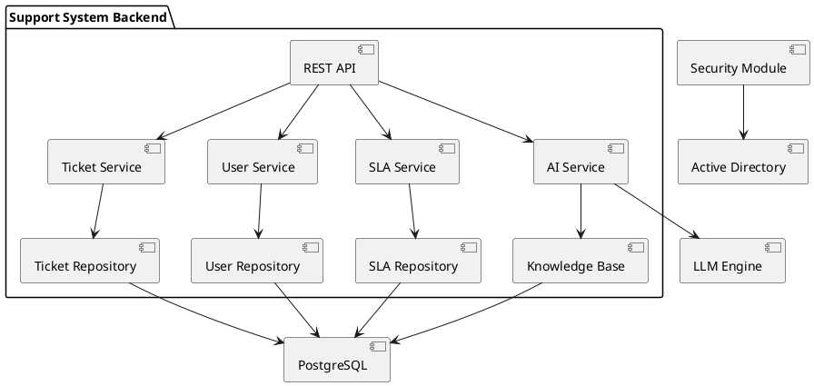

# UML (PlantUML)

```plantuml
@startuml

package "Support System Backend" {

  [REST API] --> [Ticket Service]
  [REST API] --> [User Service]
  [REST API] --> [SLA Service]
  [REST API] --> [AI Service]

  [Ticket Service] --> [Ticket Repository]
  [User Service] --> [User Repository]
  [SLA Service] --> [SLA Repository]
  [AI Service] --> [Knowledge Base]

}

[Knowledge Base] --> [PostgreSQL]
[Ticket Repository] --> [PostgreSQL]
[User Repository] --> [PostgreSQL]
[SLA Repository] --> [PostgreSQL]

[AI Service] --> [LLM Engine]
[Security Module] --> [Active Directory]

@enduml
```

```
