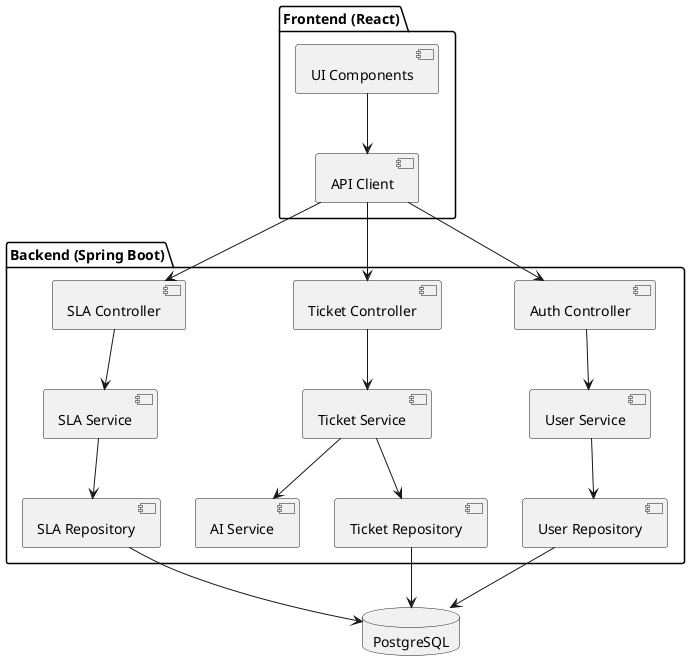

# UML (PlantUML)

```plantuml
@startuml

package "Frontend (React)" {
  [UI Components]
  [API Client]
}

package "Backend (Spring Boot)" {

  [Auth Controller]
  [Ticket Controller]
  [SLA Controller]

  [User Service]
  [Ticket Service]
  [SLA Service]
  [AI Service]

  [User Repository]
  [Ticket Repository]
  [SLA Repository]
}

database "PostgreSQL" {
}

[UI Components] --> [API Client]
[API Client] --> [Auth Controller]
[API Client] --> [Ticket Controller]
[API Client] --> [SLA Controller]

[Auth Controller] --> [User Service]
[Ticket Controller] --> [Ticket Service]
[SLA Controller] --> [SLA Service]

[Ticket Service] --> [Ticket Repository]
[User Service] --> [User Repository]
[SLA Service] --> [SLA Repository]

[Ticket Service] --> [AI Service]

[User Repository] --> "PostgreSQL"
[Ticket Repository] --> "PostgreSQL"
[SLA Repository] --> "PostgreSQL"

@enduml
```
Чёткое разделение слоёв

Controller → Service → Repository

AI — часть бизнес-логики

Backend изолирован от БД через репозитории
