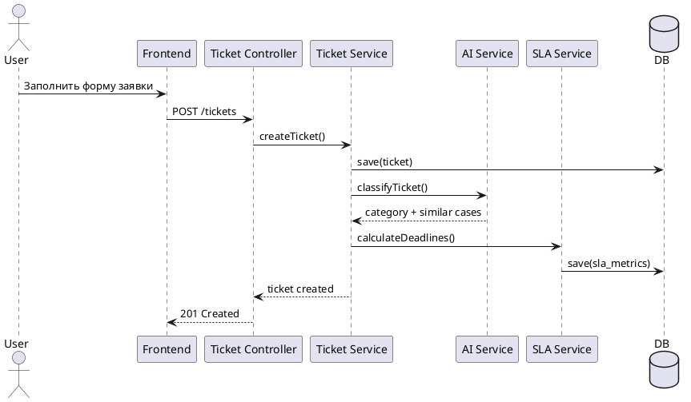
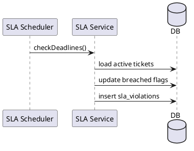

##Сценарий 1: Создание заявки + расчёт SLA + AI-анализ
# UML (PlantUML)

```plantuml
@startuml

actor User
participant Frontend
participant "Ticket Controller" as TC
participant "Ticket Service" as TS
participant "AI Service" as AI
participant "SLA Service" as SLA
database DB

User -> Frontend : Заполнить форму заявки
Frontend -> TC : POST /tickets
TC -> TS : createTicket()

TS -> DB : save(ticket)

TS -> AI : classifyTicket()
AI --> TS : category + similar cases

TS -> SLA : calculateDeadlines()
SLA -> DB : save(sla_metrics)

TS --> TC : ticket created
TC --> Frontend : 201 Created

@enduml

```
##Сценарий 2: Проверка SLA (Scheduled)
# UML (PlantUML)

```plantuml
@startuml

participant "SLA Scheduler"
participant "SLA Service" as SLA
database DB

"SLA Scheduler" -> SLA : checkDeadlines()

SLA -> DB : load active tickets
SLA -> DB : update breached flags
SLA -> DB : insert sla_violations

@enduml
```
