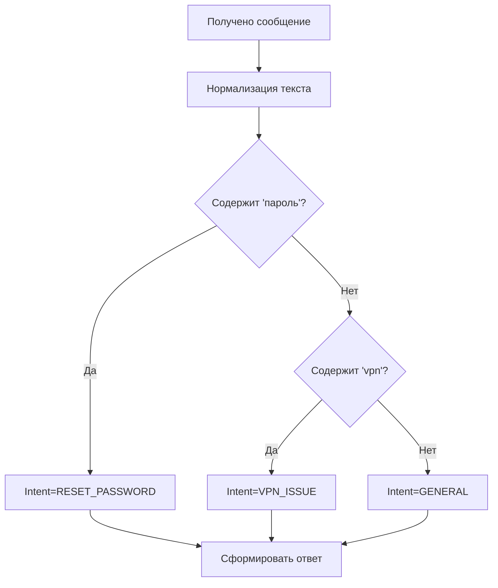

# Блок-схема алгоритма классификации

```mermaid
flowchart TD
  A[Получено сообщение] --> B[Нормализация текста]
  B --> C{Содержит 'пароль'?}
  C -- Да --> D[Intent=RESET_PASSWORD]
  C -- Нет --> E{Содержит 'vpn'?}
  E -- Да --> F[Intent=VPN_ISSUE]
  E -- Нет --> G[Intent=GENERAL]
  D --> H[Сформировать ответ]
  F --> H
  G --> H
```
