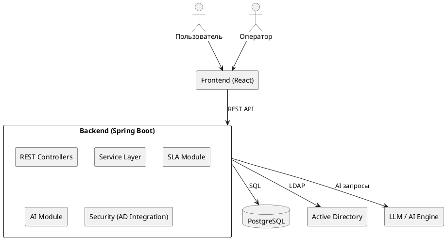

# UML (PlantUML)

Архитектура построена по принципу client-server
Backend реализован на Spring Boot
Используется реляционная СУБД
Интеграция с AD через LDAP
Интеллектуальный модуль не взаимодействует напрямую с пользователем
