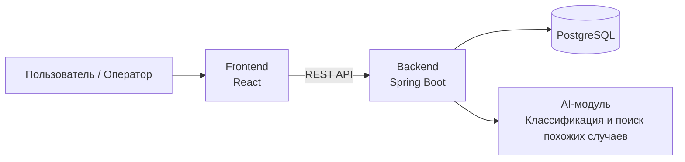

# ER-диаграмма

Клиентская часть реализована ??????.

Серверная часть — Spring Boot 3.x.

Взаимодействие осуществляется через REST API.

Данные хранятся в PostgreSQL.

Интеллектуальный модуль встроен в backend и используется для: классификации обращения, поиска похожих кейсов, подбора статей из базы знаний
