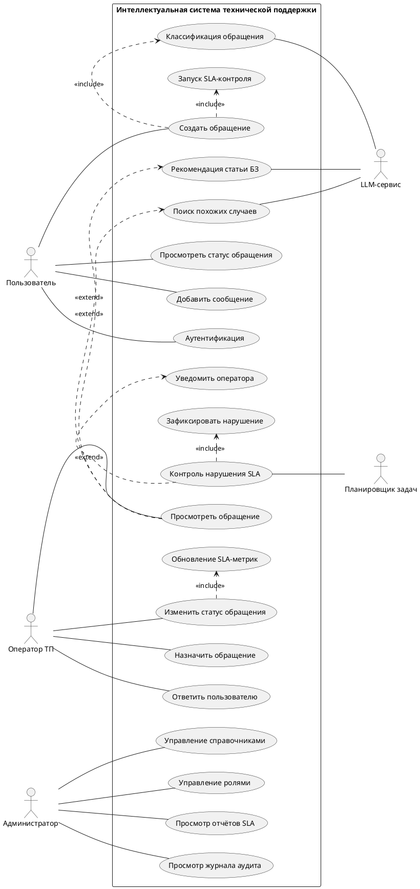

# UML (PlantUML)

```plantuml
@startuml
left to right direction
skinparam packageStyle rectangle

actor "Пользователь" as User
actor "Оператор ТП" as Operator
actor "Администратор" as Admin
actor "LLM-сервис" as LLM
actor "Планировщик задач" as Scheduler

rectangle "Интеллектуальная система технической поддержки" {

  ' --- Пользователь ---
  User -- (Создать обращение)
  User -- (Просмотреть статус обращения)
  User -- (Добавить сообщение)

  User -- (Аутентификация)

  ' --- Оператор ---
  Operator -- (Просмотреть обращение)
  Operator -- (Назначить обращение)
  Operator -- (Изменить статус обращения)
  Operator -- (Ответить пользователю)

  ' --- Администратор ---
  Admin -- (Управление справочниками)
  Admin -- (Управление ролями)
  Admin -- (Просмотр отчётов SLA)
  Admin -- (Просмотр журнала аудита)

  ' --- Интеллектуальный модуль ---
  (Создать обращение) .> (Классификация обращения) : <<include>>
  (Просмотреть обращение) .> (Рекомендация статьи БЗ) : <<extend>>
  (Просмотреть обращение) .> (Поиск похожих случаев) : <<extend>>

  (Классификация обращения) -- LLM
  (Рекомендация статьи БЗ) -- LLM
  (Поиск похожих случаев) -- LLM

  ' --- SLA подсистема ---
  (Создать обращение) .> (Запуск SLA-контроля) : <<include>>
  (Изменить статус обращения) .> (Обновление SLA-метрик) : <<include>>

  (Контроль нарушения SLA) -- Scheduler
  (Контроль нарушения SLA) .> (Уведомить оператора) : <<extend>>
  (Контроль нарушения SLA) .> (Зафиксировать нарушение) : <<include>>

}
@enduml
```
