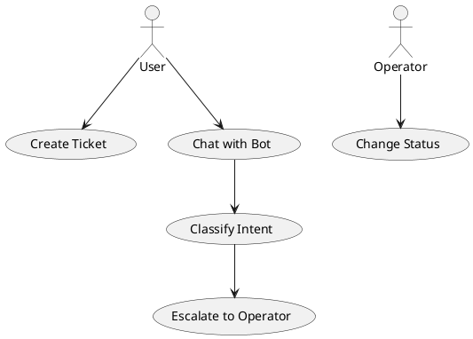

# UML (PlantUML)

```plantuml
@startuml
actor User
actor Operator
User --> (Create Ticket)
Operator --> (Change Status)
User --> (Chat with Bot)
(Chat with Bot) --> (Classify Intent)
(Classify Intent) --> (Escalate to Operator)
@enduml
```
