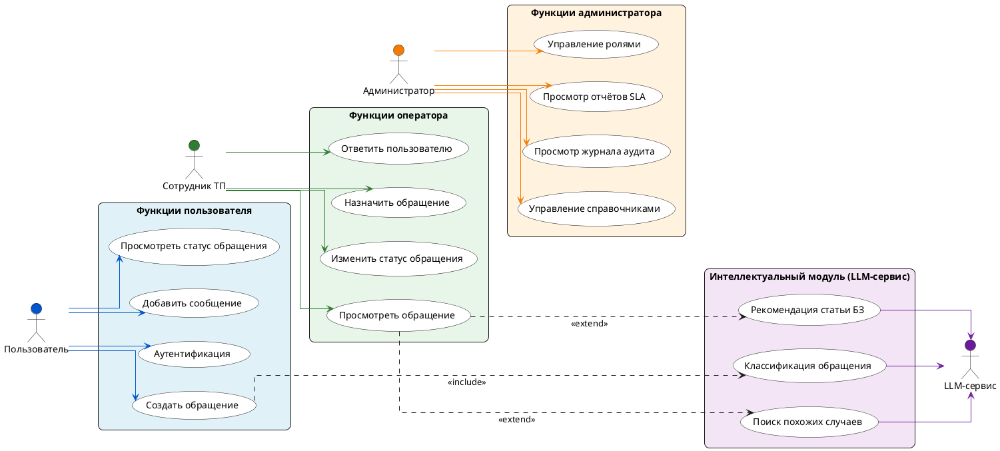

# UML (PlantUML)

```plantuml
@startuml
skinparam linetype polyline
skinparam linetype ortho
left to right direction
skinparam packageStyle rectangle
skinparam shadowing false
skinparam roundcorner 15

' ------------------ АКТОРЫ ------------------
actor "Пользователь" as User #0055CC
actor "Сотрудник ТП" as Operator #2E7D32
actor "Администратор" as Admin #F57C00
actor "LLM-сервис" as LLM #6A1B9A

' ------------------ ПАКЕТЫ USE CASE ------------------
rectangle "Функции пользователя" #E0F2F7 {
    (Аутентификация) #FFFFFF
    (Создать обращение) #FFFFFF
    (Просмотреть статус обращения) #FFFFFF
    (Добавить сообщение) #FFFFFF
}

rectangle "Функции оператора" #E8F5E9 {
    (Просмотреть обращение) #FFFFFF
    (Назначить обращение) #FFFFFF
    (Изменить статус обращения) #FFFFFF
    (Ответить пользователю) #FFFFFF
}

rectangle "Функции администратора" #FFF3E0 {
    (Управление справочниками) #FFFFFF
    (Управление ролями) #FFFFFF
    (Просмотр отчётов SLA) #FFFFFF
    (Просмотр журнала аудита) #FFFFFF
}

rectangle "Интеллектуальный модуль (LLM-сервис)" #F3E5F5 {
    (Классификация обращения) #FFFFFF
    (Рекомендация статьи БЗ) #FFFFFF
    (Поиск похожих случаев) #FFFFFF
}

' ------------------ СВЯЗИ ------------------
' Пользователь
User --> (Аутентификация) #0055CC
User --> (Создать обращение) #0055CC
User --> (Просмотреть статус обращения) #0055CC
User --> (Добавить сообщение) #0055CC

' Оператор
Operator --> (Просмотреть обращение) #2E7D32
Operator --> (Назначить обращение) #2E7D32
Operator --> (Изменить статус обращения) #2E7D32
Operator --> (Ответить пользователю) #2E7D32

' Администратор
Admin --> (Управление справочниками) #F57C00
Admin --> (Управление ролями) #F57C00
Admin --> (Просмотр отчётов SLA) #F57C00
Admin --> (Просмотр журнала аудита) #F57C00

' Интеллектуальный модуль / LLM
(Создать обращение) .-> (Классификация обращения) : <<include>> 
(Просмотреть обращение) .-> (Рекомендация статьи БЗ) : <<extend>> 
(Просмотреть обращение) .-> (Поиск похожих случаев) : <<extend>> 

(Классификация обращения) --> LLM #6A1B9A
(Рекомендация статьи БЗ) --> LLM #6A1B9A
(Поиск похожих случаев) --> LLM #6A1B9A

' ------------------ Скрытые линии для горизонтального выравнивания ------------------
(Аутентификация) -[hidden]- (Просмотреть обращение)
(Просмотреть обращение) -[hidden]- (Управление справочниками)
(Управление справочниками) -[hidden]- (Классификация обращения)

@enduml
```
